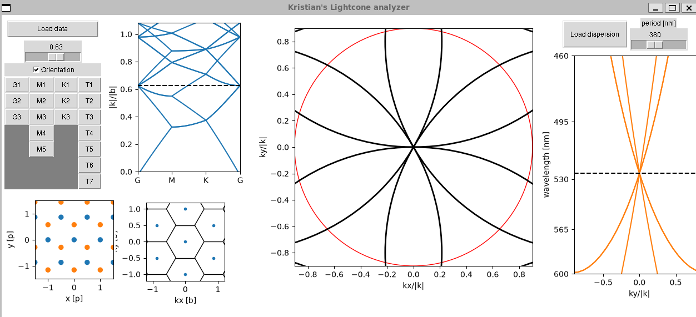

# Installation

This program requires the following packages
```
scipy (v. 1.18.1)
numpy (v. 2.5.2)
pyplot (v. 3.11.2)

opencv2 (v. 5.0.0)
PIL (v. 12.3.0)

```

# Running the script

After the packages are installed, the script can simply be run with 'python3 visu3.py'.

This should open the window shown below


The sliders control the magnitude of the wavevector, which corresponds to the energy, and the period of the structure.

The 'load data'-button opens a dialog, where a k-space measurement can be loaded, either as a png or numpy-zip file.
The program then identifies the largest circle in the image and crops it to be displayed.

The 'load dispersion' opens a similar dialogg, where the dispersion data can be loaded into the program in image format.
The program finds and extracts the largest rectangle in the image, which should correspond to the measurement data.
